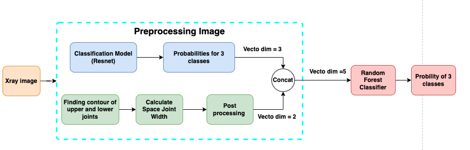

best.pt to store pretrianed YOLO model which was used to do segmentation
bestresnet.pt to store model classification.

Data was preprocessed in preprocess.py
The flow of processing is descriped in the flow diagram:
